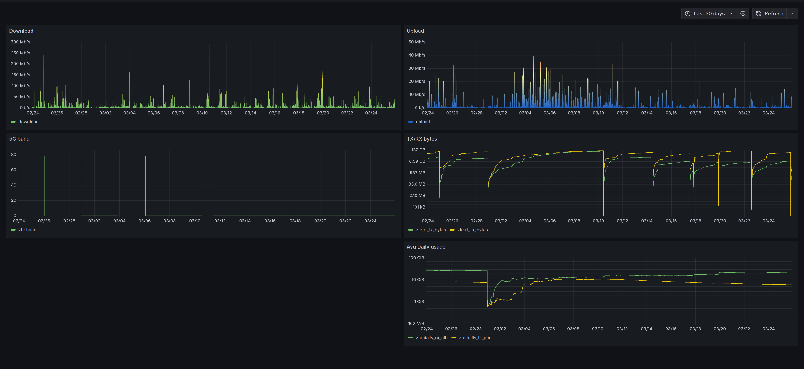

# ZTE MC888 5G Monitor

Monitor ZTE MC888 5G modem stats and report them to InfluxDB.

My main use case was to monitor the 5G band usage and bandwidth with Grafana.

There's also a `pkg/zte` package that can be used to connect to the modem, login and send various commands.

It might also work on other ZTE 5G modems, but I only tested it on MC888.

## Usage

1. Create `.env` file based on `.env.example`
2. Use the `compose.yml` file
3. (Optionally) Use the `contrib/grafana-dashboard.json` file

## Screenshot

